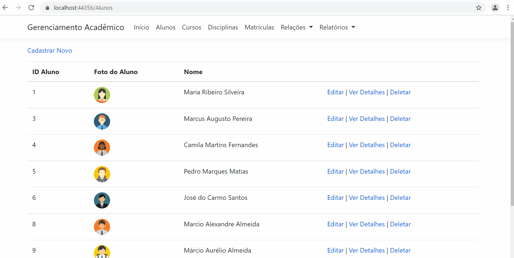
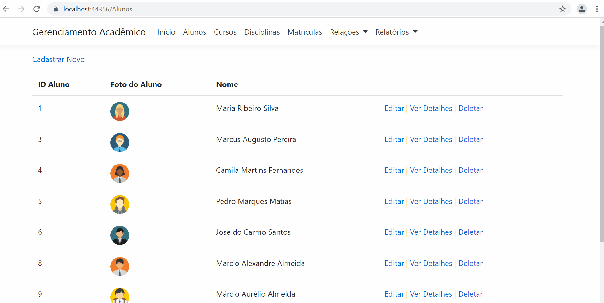

# Gerenciamento Acadêmico 

Aplicação Web para Gerenciamento Acadêmico
> Versão **1.0** 

| [ CADASTRAR ALUNO](src/Demo_Cadastrar_Aluno.gif) | [ CADASTRAR ALUNO](src/Demo_Cadastrar_Aluno.gif)  | [ ATUALIZAR DADOS DO ALUNO](src/Demo_Atualizar_Foto_Alunos.gif)  |
| :---: | :---: | :---: |

---
### Funcionalidades implementadas 📖

+ Cadastro de alunos
+ Atualização dos dados dos alunos
+ Exclusão de alunos
+ Visualização dos dados dos alunos 
+ Cadastro de cursos
+ Atualização dos dados dos cursos
+ Exclusão de cursos
+ Visualização dos dados dos cursos 
+ Cadastro de disciplinas 
+ Atualização dos dados das disciplinas
+ Exclusão de disciplinas
+ Visualização dos dados das disciplinas
+ Cadastro de matrícula dos alunos aos cursos
+ Atualização dos dados das matrículas
+ Exclusão de matrículas
+ Visualização dos dados das disciplinas
+ Solitação de disciplinas
+ Atualização dos dados da solicitação 
+ Exclusão de solicitação 
+ Visualização dos dados da solicitação de disciplinas
+ Atribuição de notas
+ Atualização da atribuição de notas
+ Exclusão de notas
+ Visualização dos dados da atrbuição de notas
+ Geração de relatório de notas com filtros de busca
+ Geração de relatório de disciplinas por cursos com filtros de busca
+ Geração de relatório de matrícula de alunos por disciplinas com filtros de busca

---

### Aplicação 💻

**Arquitetura WEB** 

   

 

**Linguagens** 

  
   
  
  

 

**Ambiente de Desenvolvimento** 

  

 

**Database**

  

 

**Framework**

  

 

**Dependências**
